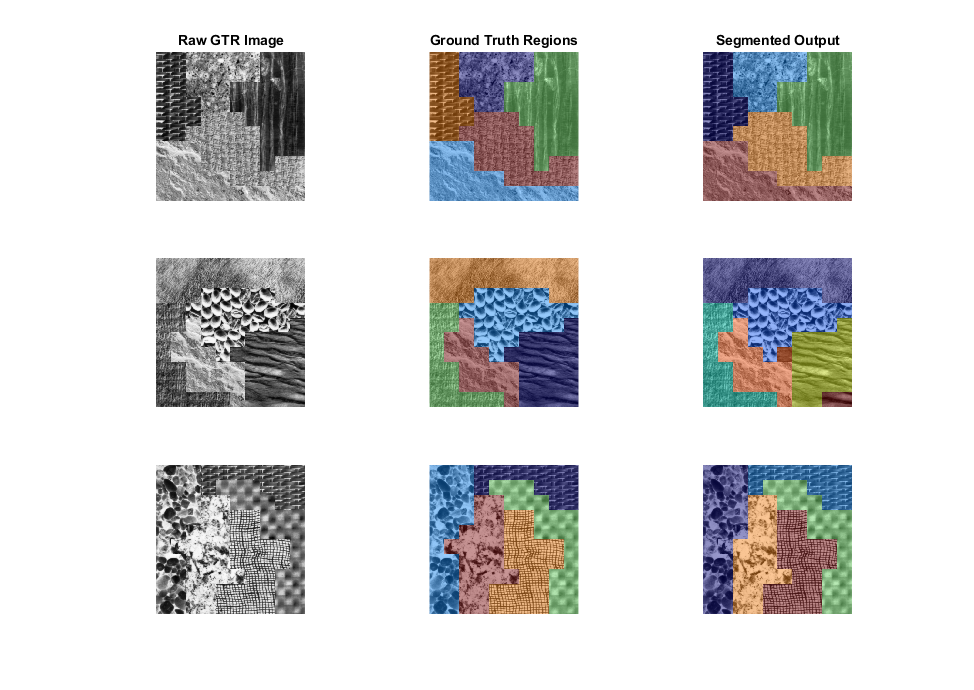

# texture-learning

Code for **"Proximity as a Ground-Truth Proxy for Training Texture Discrimination and Segmentation"**
(W. S. Geisler, [bioRxiv 2026](https://www.biorxiv.org/content/10.64898/2026.05.12.724620v1.abstract)).



## What it does

Telling whether two image patches are the *same* or *different* texture normally needs labelled ground
truth. This project's idea is that **spatial proximity is a free proxy for that label** — nearby patches
are usually the same texture, distant patches usually different — and, under mild assumptions, the
optimal *near-vs-far* decision boundary is the same as the optimal *same-vs-different* boundary. So a
biologically-plausible **Hierarchical Bayesian Observer (HBO)** model of texture discrimination can be
trained directly from *unlabelled* natural images, and then used to segment "grown-texture-region"
(GTR) images. See the [foundational segmentation paper](https://www.biorxiv.org/content/10.64898/2026.05.06.723304v1.abstract)
for the HBO model this builds on.

## Dependencies

- **[vislab-common](https://github.com/abhranildas/vislab-common)** — the lab's shared MATLAB library
  (the `+vislab` package inside the sibling `vislab-common` folder; `setup.m` clones it automatically if
  it's missing). Provides `vislab.lib.*` (optics, filters, normalization, …) and
  `vislab.nat_stat_bayes.*` (the decision-variable / natural-scene-statistics toolkit).
- **[IntClassNorm](https://github.com/abhranildas/IntClassNorm)** and
  **[gx2](https://github.com/abhranildas/gx2)** — installed MATLAB **add-on toolboxes** (Add-On Explorer /
  File Exchange). `setup.m` verifies they're installed; they are *not* bundled or fetched as source.
- **vislab-common/data** — the shared data store, a sibling folder alongside this repo. Its texture sheets
  and colour transforms ship inside the `vislab-common` repo (so `setup.m`'s auto-clone brings them along);
  the large calibrated **natural-image** set (~19 GB) is **too large for GitHub** and must be obtained
  separately. However, a small **12-image demo subset** (4 images from 3 sets) is included directly in the repo to allow out-of-the-box training. The model uses a **constant-volume sampling algorithm**, which dynamically increases the per-image patch count when run on small datasets so that the total number of sampled patches (and patch-pairs) remains fixed at ~7,820 regardless of dataset size. This ensures the demo dataset provides the same statistical richness as the full dataset.
- MATLAB with the Image Processing and Statistics & Machine Learning toolboxes (and the Deep Learning
  Toolbox for the twin network in `twin-net/`).

## Installation and Setup

- Download or git clone this repository to your local machine.
- Install git (so that the `setup` script can automatically git clone the `vislab-common` dependency)
- Within MATLAB, navigate to the repo folder and run:
```matlab
setup            % adds this repo + vislab to the path; checks the toolboxes
cfg = config;    % paths + parameters; edit cfg.paths.data_root if vislab-common/data isn't a sibling
```

## Quick demo

The `run_demo.m` script demonstrates the entire model lifecycle. By changing the `demo_type` variable at the top of the script, you can run it in two modes:

- **`quick` mode**: Skips the expensive training phase (Stages 1-5) and uses the pre-trained models shipped in `data/models/`. It plots the learned parameters, and then evaluates the model (Stages 6-7) on a small set of Grown-Texture-Region (GTR) images. The evaluation takes a few minutes to run.
- **`full` mode**: Re-trains the model from scratch (Stages 1-5) before evaluating. During training, the script will pause to ask if you want to save (and overwrite) the newly-learned parameters to disk.

```matlab
run_demo      % runs the demo according to the selected demo_type
```

## Repository layout

```
texture-learning/
├── setup.m, config.m         path bootstrap + central configuration
├── pipeline/                 numbered pipeline stages s1..s7 (+ list_natural_images helper)
├── +segmentation/            grouping algorithm (content-similarity, grouping, region scoring)
├── +gtr/                     GTR stimulus generation (texture-region masks, texture assignment)
├── twin-net/                 twin/Siamese network comparison (learned; needs Deep Learning Toolbox)
├── data/models/              shipped trained artifacts (PCA, priors, AHEO bins, dbnd bounds, net_on_nat)
├── data/stimuli/             generated data (patch pairs, results) — git-ignored
└── docs/                     papers
```

Shared low-level code lives in `vislab` (not here), so it isn't duplicated across the lab's repos.

## Model pipeline

The demo runs these stages in order (each is a function taking `cfg`). Stages 1–5 learn the model from natural
images and write artifacts to `data/models/`; stages 6–7 apply/evaluate it on GTR images.

| Stage | Function (`pipeline/`) | Produces |
|---|---|---|
| 1 | `s1_learn_color_transform(cfg)` | `vislab-common/data/cps_lms2abr_otf.mat` — LMS→ABR colour rotation (lab-shared) |
| 2 | `s2_learn_feature_priors(cfg)` | `priors_abr_mo13_mo23_cs33_otf.mat` — natural feature priors |
| 3 | `s3_make_nearfar_pairs(cfg, ecc)` | `patch_pairs_ecc<ecc>.mat` — near/far training pairs |
| 4 | `s4_optimize_bins(cfg, dim, ecc)` | `AHEO<btype><dim><ecc>.mat` — adaptive histogram bins |
| 5 | `s5_train_decision_vars(cfg, ecc)` | `dbnd{h,e,c,b,bc}NO<ecc>.mat` — trained decision-variable bounds |
| 6 | `s6_selfsup_discrimination(cfg, method, itype, ecc, ntrl)` | per-image self-supervised discrimination accuracy surfaces (runs on GTR images built from Brodatz/Fabric source textures — see Quick demo) |
| 7 | `s7_segment_gtr(cfg, method, itype, ecc, n_images)` | GTR segmentation: correct-region counts over the merge x grouping-offset grid |

## Twin network (learned comparison)

`twin-net/` holds a twin/Siamese network that plays the same game as the Bayesian model,
but learns its features instead of using hand-defined ones. It trains on natural-image **near/far**
patch pairs (the same proximity proxy) and is tested on **same/different** texture pairs, to see how
far a learned model transfers. `train_net.m` is the entry point; `twin-net/net_plan.md` tracks the design,
results, and open to-dos. It needs the Deep Learning Toolbox. The trained network ships as
`data/models/net_on_nat.mat`; the texture test set is generated by `texture_same_diff_patches_net.m`
into the git-ignored `data/stimuli/textures/`.

The twin network and the Bayesian pipeline share one ingestion path: both read parameters from `config.m` and
process every source image through the same `vislab.nat_stat_bayes.source_to_lms` (optics, RGB→LMS,
per-database gray/gamma/resize flags from `cfg.textures`), so optics and calibration cannot drift
between the two models. Only the sampling strategy differs (the Bayesian pre-generates near/far pairs;
the twin network samples fresh pairs on the fly).

## Model Data

The pipeline saves its trained parameters and intermediate datasets as `.mat` files. Shipped, pre-trained parameters are located in `data/models/`, while generated files are saved to `data/stimuli/` (which is git-ignored).

Here is a simple breakdown of the data files you'll encounter:

- **`cps_lms2abr_otf.mat`**: The LMS→ABR color space transformation matrix. This file is **not** duplicated in this repository; it lives exclusively in the lab's shared `vislab-common/data/` folder so all projects use the exact same calibration.
- **`priors_abr_mo13_mo23_cs33_otf.mat`**: The natural marginal probability distributions (priors) for the model's low-level image features.
- **`patch_pairs_ecc<ecc>.mat`**: Large datasets of *near* (likely same texture) and *far* (likely different texture) patch pairs, extracted directly from unlabelled natural images to train the model.
- **`AHEO<btype><dim><ecc>.mat`**: Adaptive histogram bin boundaries used for discretizing the feature responses.
- **`decision_bounds_ecc<ecc>.mat`**: The final trained quadratic decision boundaries for determining whether two patches belong to the same or different textures.

*(Note: `<ecc>` refers to the spatial eccentricity-related downsampling factor of the patches, typically 1, 2, 4, or 8).*

## Glossary

Decoder for the terse names in this codebase: code term ↔ paper symbol/notation ↔ meaning.
*(Paper = Geisler proximity paper and the foundational Geisler & Das segmentation paper).*

### Colour & optics
| Code | Paper | Meaning |
|---|---|---|
| `LMS` / `lms` | L,M,S | long/medium/short-wavelength cone responses per pixel |
| `ABR` / `abr` | a, b, r | opponent colour axes from PCA of LMS: **A**chromatic, **B**lue-yellow, **R**ed-green |
| `coeff` / `color_rotation` | — | 3×3 LMS→ABR rotation matrix (PCA components) |
| `OTF` | — | optical transfer function of the eye (Watson 2013) |
| `ppd` | — | pixels per degree (**60** for display/GTR images, **64** for the natural images: 64 px = 1°) |
| `pd`, `w` | d, λ | pupil diameter (mm), wavelength (nm) |
| `m0`, `c0` | — | target mean (128) and RMS contrast (0.25) for patch normalization |

### Feature dimensions (indices 1–14)
1 A pixel · 2 B pixel · 3 R pixel · 4 edge count · 5 edge magnitude · 6 edge orientation ·
7 edge mag×ori · 8 bar count · 9 bar magnitude · 10 bar orientation · 11 bar mag×ori ·
12 center-surround ratio (small) · 13 center-surround linear (small) · 14 center-surround linear (large).
The pipeline uses spot dims **[1 13 14]** and edge dims **[5 9 10]** in the content DV.

### Decision variables (paper log-likelihood ratios ln L → code)
| Code (vislab `vislab.nat_stat_bayes.*`) | Was | Paper | Meaning |
|---|---|---|---|
| `dv_power` | `Rp` | ln L_p | power-spectrum DV (complex-cell-like) |
| `dv_spot_hist` | `Rh` | ln L_h | spot/colour + center-surround histogram DV |
| `dv_edge_hist` | `Re` | ln L_e | edge/bar steerable-filter histogram DV |
| `dv_border` | `Rb` | E_b, Ē_b | border edge-energy DVs (+ cross-correlation) |
| `multinomial_llr` | (inline) | Eq. 1 / A4 | multinomial histogram log-likelihood ratio |
| (content) | — | ln L_c | content DV = combination of power+spot+edge |
| (border+content) | — | ln L_bc | joined similarity DV = combination of border+content |

### Similarity & grouping
| Code | Paper | Meaning |
|---|---|---|
| `phi` / `phiall` | φ_ij | content similarity (log-likelihood ratio) between patches i,j |
| `mu`, `u`, `rho` | μ_ij, u_ij | mutual similarity = cosine similarity of the two patches' similarity vectors |
| `wm` | w_m | mutual-similarity weight |
| `gc` | γ_l | local-similarity grouping criterion |
| `cc` | γ_c | confidence criterion (weak links near the bound left unlinked) |
| `mc` / `merge_criterion` | γ_r | region-similarity merge criterion |
| `copt` | — | per-image optimal criterion shift learned self-supervised |
| `p_s`, `p_d` | p_s, p_d | prob. same for near pairs / prob. different for far pairs (mixture params) |

### Eccentricities, datasets, methods
| Code | Meaning |
|---|---|
| `ecc` | eccentricity downsample factor 1/2/4/8 (≈ fovea, 1.65°, 4.95°, 11.55°) |
| `btype` | histogram-bound type: **5** = natural images, **4** = Brodatz/Fabric |
| `itype` | texture dataset: 1 Pertex · 2 Fabric · 3 Brodatz · 4 Brodatz+Fabric · 5 VisTex · 6 McGill |
| `NO` (in `dbnd*NO`) | **N**atural-image-trained + **O**TF applied (vs `BF` = Brodatz/Fabric-trained) |
| N, NC, NCB, NM, NCM, NCBM | training methods: N=natural-image-trained; +C content-criterion adjust; +B border adjust; +M mutual-similarity weight |
| GTR | grown-texture-region image (random regions filled with random textures) |
| `b0` | β, weak Fourier-power suppression constant |


## License & citation

Code released under the MIT License (see `LICENSE`). If you use it, please cite the paper above.
